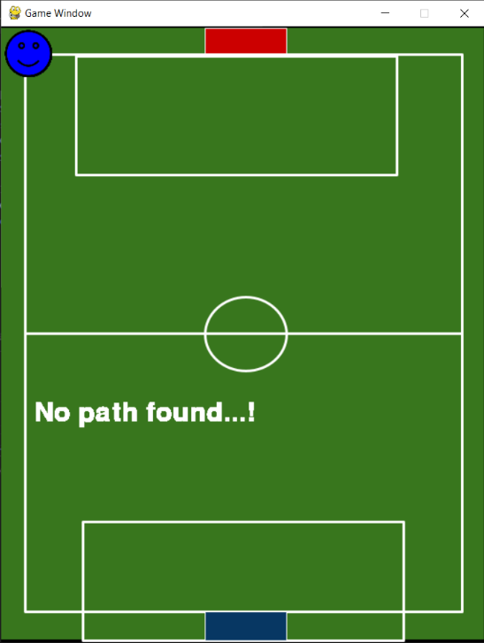
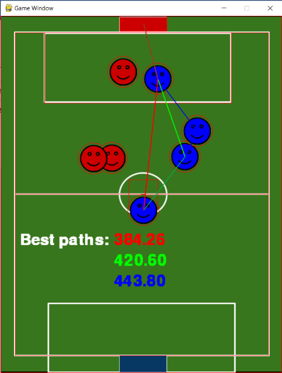
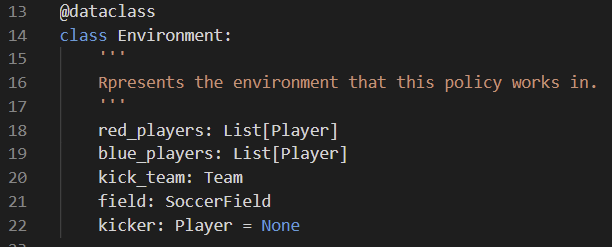
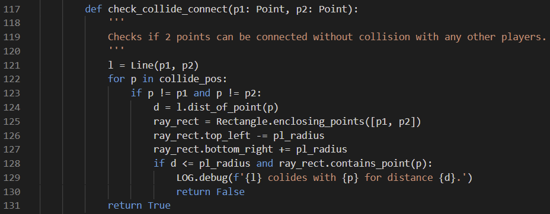

# AI2 - Assignment 1

> See [Report.pdf](./Report.pdf) and [Video demonstration](https://youtu.be/vMqobxDOq78)
> 

  

## Question

The task is to model an agent to perform assisted goal shootout in the game of soccer. This is a simple implementation of policies; no learning is expected by the agent.

- There are 2 teams, team RED and team BLUE
- Team RED has 3 players and team BLUE has 4 players (1 Kicker and 3 in team RED play area).
- The players cannot move from their respective places once the game starts.
- Team BLUE is performing an assisted goal shootout but from the Centre Circle position. (Condition 1)
- So, one player from the BLUE team must remain at the centre circle to take an assisted goal shoot.
- One player from each team will be staying in the Team RED goal box and will not leave it. (Condition 2)
- Apart from the centre kicker from team BLUE players, the rest of the players will remain in the upper part as shown (RED Team area). (Condition 3)
- Shootouts must be done from the centre by the team BLUE player as shown in the below image.
- How to Play:
  - The assisted goal shoot will be taken by a TEAM BLUE player from the centre.
  - The kicker is our agent.
  - The agent needs to decide the shortest goal path, this will be your heuristic cost. (has to be assisted goal) (Condition 4)
  - With every run, the position of players will be changed, which has to be randomized and should satisfy the previous condition. (Condition 5)

## Running the program

To run the program the following pre-requisites must be installed on your system,

- Python: ^[3.9.2](https://www.python.org/downloads/release/python-392/)
- Poetry: ^[1.0.0](https://python-poetry.org/docs/#installation)

The poetry library is used to ensure package compatibility and system cleanliness since it automatically makes use of python virtual environments.

> **NOTE** that all other dependencies (like pygame etc.) are installed in the `.venv` folder and the user does not have to handle anything except installing python and poetry.

Once poetry is installed,

- Open a command prompt and navigate into the code folder (the top-level folder containing `pyproject.toml`).
- Then simply run the command `poetry run main`.

## Output

### Start screen

This screen represents the uninitialized state of the program. To start the program, press the ‘X’ key.

The various controls for the program are as follows:-

- Press `X` to: Relocate players randomly.
- Press `B` to: Show/hide the bounding boxes of objects.
- Press `Esc` to: Quit the program.

### Possible Shots

Once the program has started press `X` to relocate players randomly. Doing this automatically computes the top 4 shortest paths to score a goal and displays the path lengths as well as coloured lines of the paths to follow.

| Sample 1 | Sample 2 |
|:-:|:-:|
|||

## Code

The environment is modelled as a data structure containing the following information,

|[Environment - policy.py](./soccer_agent/policy.py#L14)|
|:-:|
||

To find the shortest path from the kicker to the centre of the goal, the program performs a Depth First Search over all positions of the blue team players. Each position checks whether a pass can be sent from the current position to any of the teammates that have not been explored during DFS. To check is a pass is possible, the program performs 2 tasks, given a 2D point `P_1` and `P_2`,

- For each point `P_0` as position of player that can receive a pass check if
- Minimum distance of the line from `P_1P_2` from `P_0` `> radius_{player}`
- Smallest rectangle containing `P_1` and `P_2` also contains `P_0`.

|[Circle to Line Collision Detection - policy.py](./soccer_agent/policy.py#L117)|
|:-:|
||
